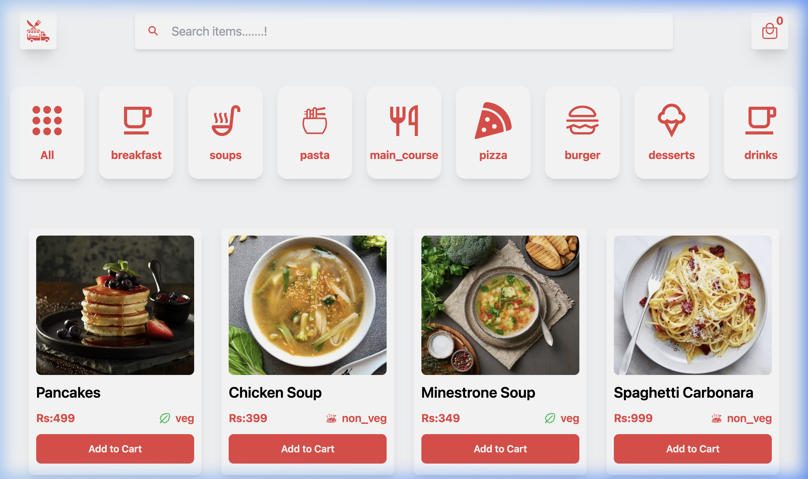
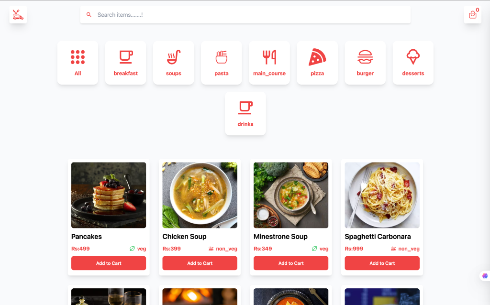
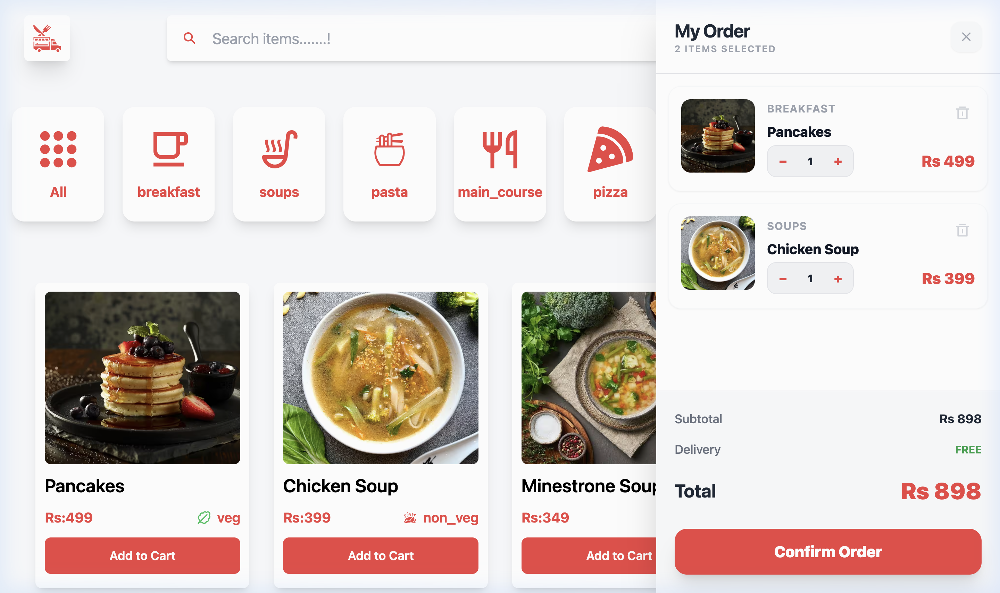
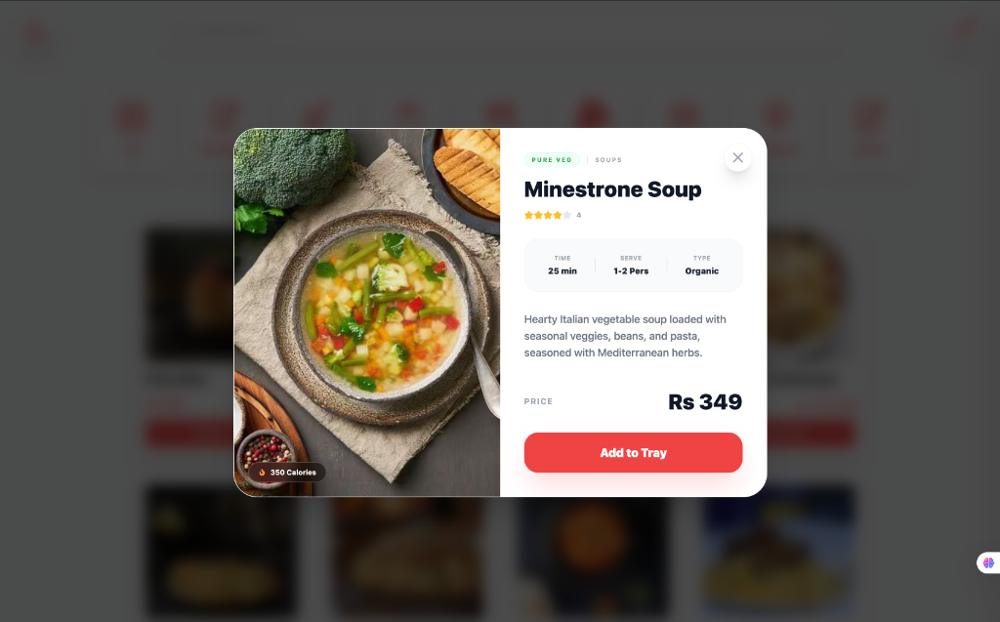

# FOODApp - Premium Food Delivery Frontend



## Why FOODApp? (The Motivation)

This project was built during my journey of Learning React. The primary goal was to master the fundamental and advanced patterns of modern web development. 

Building FOODApp helped me solidify my understanding of:
- Modular Components: Creating reusable UI blocks to keep the code DRY and maintainable.
- Props Management: Efficiently passing data and functions across the component hierarchy.
- Context API: Implementing a global state management system to handle a real-time shopping cart and user preferences seamlessly.

---

## What is FOODApp?

FOODApp is a high-fidelity, responsive food delivery interface. It is a showcase of clean design and efficient frontend logic.

### Key Features
- Instant Search: Real-time filtering of items from a rich dataset of 36+ food items.
- Dynamic Categorization: Interactive category buttons for Breakfast, Soups, Pasta, Pizza, and more.
- Functional Shopping Tray: A real-time cart with quantity controls, subtotal calculations, and a smooth drawer interface.
- Professional Interactions: Custom toast notifications for item additions and a premium Order Success flow.
- Fully Responsive: Optimized layouts for ultra-wide monitors, tablets, and mobile devices.

### Tech Stack
- Library: React.js
- Styling: Tailwind CSS
- Icons: React Icons
- State: React Context API
- Build: Vite

---

## Project Structure

```text
src/
├── Components/
│   ├── Card.jsx                 (Food item display)
│   ├── Card2.jsx                (Shopping cart item)
│   ├── DetailsPopup.jsx         (Product modal)
│   ├── Footer.jsx               (Page footer)
│   ├── Nav.jsx                  (Main navigation)
│   └── OrderSuccessPopup.jsx    (Post-checkout modal)
├── Pages/
│   ├── Home.jsx                 (Main layout and logic)
│   └── Category.jsx             (Category data and icons)
├── context/
│   └── UserContext.jsx          (Global state management)
├── assets/                       (Images and static icons)
├── App.jsx                       (Root application)
├── food.js                       (Main product dataset)
└── index.css                     (Global style definitions)
```

---

## Project Showcase

| Integrated Categories | Real-time Shopping Tray | Product Details View |
| :---: | :---: | :---: |
|  |  |  |

---

## How to Run

To get this project running on your local machine, follow these steps:

### 1. Clone the repository
```bash
git clone https://github.com/your-username/food-app.git
cd Foodapp
```

### 2. Install dependencies
Ensure you have Node.js installed, then run:
```bash
npm install
```

### 3. Start the development server
```bash
npm run dev
```
The app will be available at `http://localhost:5173`.

---

Designed and Developed with focus on React mastery.
